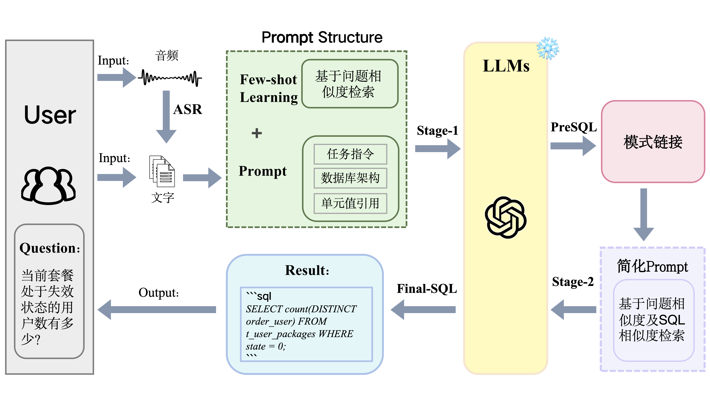

# **Audio2Text2SQL**



## 项目简介

该项目旨在通过使用大语言模型（LLM）来实现从音频或文本输入生成SQL语句的功能。通过将用户的自然语言查询转化为结构化的SQL语句，可以大大简化数据查询的过程，尤其适用于不熟悉SQL语法的用户。

**功能特点**:
1. **多输入支持**: 支持音频和文本两种输入方式。
2. **高精度解析**: 使用先进的大语言模型进行自然语言处理，保证解析结果的准确性。
3. **多数据库支持**: 生成的SQL语句兼容多种数据库系统，如MySQL、PostgreSQL、SQLite等。
4. **轻量级**: 无需服务器或GPU即可在本地运行
5. **轻松上手**: 安装包后调整路径即可使用

## 创建&安装环境
```
conda create -n Audio2Text2SQL python=3.10
conda activate Audio2Text2SQL
```
```
pip install sentence_transformers -i https://pypi.tuna.tsinghua.edu.cn/simple
pip install faster_whisper -i https://pypi.tuna.tsinghua.edu.cn/simple
pip install openai -i https://pypi.tuna.tsinghua.edu.cn/simple
pip install SpeechRecognition -i https://pypi.tuna.tsinghua.edu.cn/simple
pip install baidu-aip -i https://pypi.tuna.tsinghua.edu.cn/simple
pip install pynput -i https://pypi.tuna.tsinghua.edu.cn/simple
python -m pip install pyaudio
另外的缺啥安啥
```
## 用法
**1.配置Openai-API以及Baidu-API，如下所示：**
```
# Openai-API配置
AZURE_OPENAI_API_KEY = '***'
AZURE_OPENAI_ENDPOINT = '***'

# 加载Baidu-API模型
BAIDU_APP_ID = '***'
BAIDU_API_KEY = '***'
BAIDU_SECRET_KEY = '***'
```
百度API接口：[百度智能云](https://login.bce.baidu.com/?account=&redirect=http%3A%2F%2Fconsole.bce.baidu.com%2Fai%2F%3F_%3D1559654571070%26fromai%3D1#/ai/speech/app/list)

**2.到Hugging Face上下载Embedding模型以及ASR模型后替换路径即可开始本项目**

- Embedding模型[DMetaSoul/Dmeta-embedding-zh](https://hf-mirror.com/DMetaSoul/Dmeta-embedding-zh/tree/main)
- ASR模型[Systran/faster-whisper-small](https://hf-mirror.com/Systran/faster-whisper-small/tree/main)

**或者**

```
git lfs install
git clone https://hf-mirror.com/Systran/faster-whisper-small
git clone https://hf-mirror.com/DMetaSoul/Dmeta-embedding-zh
```

## 可以更改的参数

**1. Few-shot Leaning使用的例子个数**

```
# 更改`k`参数即可

k = 5
top_k_indices = distances.argsort()[:k]
examples = "\n".join([f"### {questions[idx]}\n{queries[idx]}\n" for idx in top_k_indices]).strip()
```

**2.Stage-2中基于SQL相似度进行检索的阈值**
```
# 更改`threshold`参数即可

threshold = 0.4
combined_scores = compute_combined_scores(distances, mask_similarities, threshold)
combined_scores = sorted(combined_scores, key=lambda x: x[1])
top_pairs = [x for x in combined_scores if x[2] >= threshold]
```

**3.录音相关参数**
- `timeout` 参数用于设定操作的最大等待时间。
- `phrase_time_limit` 参数用于设定单个语音片段的最长录制时间。
```
audio = r.listen(source, timeout=5, phrase_time_limit=10)
```

**4.数据库相关参数**
- 对将要使用的数据库的架构和数据库中引用的数据信息进行替换
```
# 对"### 给定以下数据库架构:"以及"### 以下是相关数据库中引用的一些数据信息:"后面的信息进行修改即可

def generate_prompt(examples, question):
    return f"""
### 以下是基于类似问题提供的一些问题和相应的SQL查询的示例对：
{examples}
### 仅通过SQLite SQL查询回答问题，不需要解释。您必须在确保正确性的同时最小化SQL执行时间。 
### 给定以下数据库架构:
#
# CREATE TABLE t_di_bind_device (id INT PRIMARY KEY AUTO_INCREMENT COMMENT '唯一id',user_id VARCHAR(20) NOT NULL COMMENT '用户手机号，一个用户可绑定多个设备',mac_id CHAR(16) NOT NULL UNIQUE COMMENT '设备id，设备id长度一般为16位，每个设备都有唯一id',mac_type VARCHAR(50) COMMENT '设备型号',channel_id VARCHAR(50) COMMENT '设备渠道',bind TINYINT(1) NOT NULL COMMENT '设备绑定状态，设备绑定：1；设备解绑：0。一个设备仅有一个主绑定用户',created TIMESTAMP DEFAULT CURRENT_TIMESTAMP COMMENT '记录创建时间',modified TIMESTAMP DEFAULT CURRENT_TIMESTAMP ON UPDATE CURRENT_TIMESTAMP COMMENT '记录修改时间');
# CREATE TABLE t_device_attributes (mac_id CHAR(16) NOT NULL UNIQUE COMMENT '设备id，设备id长度一般为16位，每个设备都有唯一id',mac_type VARCHAR(50) COMMENT '设备型号',supplier_id VARCHAR(50) COMMENT '厂商id',supplier_name VARCHAR(100) COMMENT '厂商名称',channel_name VARCHAR(100) COMMENT '渠道名称',channel_id VARCHAR(50) COMMENT '渠道id',province_code VARCHAR(10) COMMENT '省码',province_name VARCHAR(100),PRIMARY KEY (mac_id));
# CREATE TABLE t_user_packages (order_id CHAR(32) NOT NULL PRIMARY KEY COMMENT '订单id，每个订单都有唯一id',mac_id CHAR(16) NOT NULL COMMENT '设备id，设备id长度一般为16位，每个设备都有唯一id',order_user VARCHAR(20) NOT NULL COMMENT '订购手机号，一个设备可绑定一个手机号、开通一种套餐',province_code VARCHAR(10) COMMENT '省码',city_code VARCHAR(10) COMMENT '市码',created TIMESTAMP DEFAULT CURRENT_TIMESTAMP COMMENT '创建时间',package_id CHAR(32) NOT NULL COMMENT '套餐id，每一类套餐具有唯一id，长度一般为32位',storage_type TINYINT(1) NOT NULL COMMENT '套餐类型，全天套餐：1，事件套餐：2',state TINYINT(1) NOT NULL COMMENT '套餐状态，当前套餐处于生效状态：1，当前套餐处于失效状态：0');
# CREATE TABLE t_device_online_status (id INT PRIMARY KEY AUTO_INCREMENT COMMENT '序号',mac_id CHAR(16) NOT NULL COMMENT '设备id',login TINYINT(1) NOT NULL COMMENT '设备上下线状态，设备上线：1，设备下线：0',created TIMESTAMP DEFAULT CURRENT_TIMESTAMP COMMENT '创建时间',modified TIMESTAMP DEFAULT CURRENT_TIMESTAMP ON UPDATE CURRENT_TIMESTAMP COMMENT '修改时间');
# CREATE TABLE t_mobile_surveillance_events (event_serial_id INT PRIMARY KEY AUTO_INCREMENT COMMENT '埋点记录id',event_id VARCHAR(100) NOT NULL COMMENT '埋点名称，包括Live_watch_time(直播观看时长),icloud_watch_time(云回放观看时长云回放观看时长),Live_play_success(直播成功),Live_play_fail(直播失败),live_play_loading_time(直播加载时间)',event_duration BIGINT COMMENT '事件持续时长，单位：毫秒；根据event_id的不同含义，可能是用户观看时长、直播加载时长或为0',event_created TIMESTAMP NOT NULL COMMENT '事件创建时间',user_id VARCHAR(20) COMMENT '用户手机号',phone_type VARCHAR(50) COMMENT '手机类型',app_version VARCHAR(20) COMMENT '和家亲app版本号',network_type VARCHAR(10) COMMENT '网络，分为WIFI、4G等',mac_id CHAR(16) NOT NULL COMMENT '设备id',extra TEXT COMMENT '其他',created TIMESTAMP DEFAULT CURRENT_TIMESTAMP COMMENT '该条记录的创建时间',modified TIMESTAMP DEFAULT CURRENT_TIMESTAMP ON UPDATE CURRENT_TIMESTAMP COMMENT '记录修改时间');
#
### 以下是相关数据库中引用的一些数据信息:
#
# t_di_bind_device (id [1, 2, 3],user_id [135****1234, 136****2345, 137****3456],mac_id [4650********8886, 7067********4287, 5078********9631],mac_type [ZNIPC, CMCC-V7B, AP6PCM0],channel_id [3450*************80, 4562*************92, 4584*************16],bind [1, 1, 1],created [2023-12-13 00:00:03.0, 2023-12-13 00:00:04.0, 2023-12-13 00:00:13.0],modified [2023-12-13 00:00:03.0, 2023-12-13 00:00:04.0, 2023-12-13 00:00:13.0]);
# t_device_attributes (mac_id [1033582000000008, 1033582000000067, 1033582000000129],mac_type [YD4X1, YD4X1, YD4X1],supplier_id [101, 102, 101],supplier_name [中国移动, 华为, 中国移动],channel_name [浙江一级, 浙江一级, 电商渠道],channel_id [3450*************80, 4562*************92, 4700*************12],province_code [33, 11, -1],province_name [浙江, 北京, 全国]);
# t_user_packages (order_id [1014029, 2022050, 2022062],mac_id [0012*************4057, 0012*************3747, 0012*************5913],order_user [15955434323, 13879520069, 136****1235],province_code [0, 0, 0],city_code [0, 0, 0],created [2024-03-18 13:28:38.0, 2022-05-01 16:54:06.0, 2022-06-19 20:58:55.0],package_id [1fa7****960c, 1fa7****864f, 1fa7****960c],storage_type [1, 1, 1],state [1, 1, 1]);
# t_device_online_status (id [1, 2, 3],mac_id [0012*************4057, 0012*************3747, 0012*************5913],login [1, 1, 1],created [2024-07-01 00:00:00.0, 2024-07-01 00:00:00.0, 2024-07-01 00:00:00.0],modified [2024-07-01 03:24:30.0, 2024-07-01 23:55:40.0, 2024-07-01 23:20:40.0]);
# t_mobile_surveillance_events (event_serial_id [1, 2, 3, 4, 5],event_id [Live_watch_time, icloud_watch_time, Live_play_success, Live_play_fail, live_play_loading_time],event_duration [252, 1413, 0, 0, 2187],event_created [2024/6/30 23:59, 2024/6/30 23:59, 2024/6/30 23:59, 2024/6/30 23:59, 2024/6/30 23:59],user_id [136****1235, 137****9579, 138****0407, 18832970987, 18260760987],phone_type [ANDROID, ANDROID, IOS, ANDROID, ANDROID],app_version [8.2.0, 8.4.0, 8.5.0, 8.2.0, 8.4.0],network_type [WiFi, 4G, WIFI, WiFi, WiFi],mac_id [0012*************4057, 0012*************3747, 0012*************5913, 0012*************5716, 0012*************4057],created [2024/6/30 23:59, 2024/6/30 23:59, 2024/6/30 23:59, 2024/6/30 23:59, 2024/6/30 23:59],modified [2024/6/30 23:59, 2024/6/30 23:59, 2024/6/30 23:59, 2024/6/30 23:59, 2024/6/30 23:59]);
#
### 问题:{question}
### SQL:
"""
```

- 更改数据库的schema信息
```
schema = """
# t_di_bind_device (id, user_id, mac_id, mac_type, channel_id, bind, created, modified);
# t_device_attributes (mac_id, mac_type, supplier_id, supplier_name, channel_name, channel_id, province_code, province_name);
# t_user_packages (order_id, mac_id, order_user, province_code, city_code, created, package_id, storage_type, state);
# t_device_online_status (id, mac_id, login, created, modified);
# t_mobile_surveillance_events (event_serial_id, event_id, event_duration, event_created, user_id, phone_type, app_version, network_type, mac_id, extra, created, modified);
"""
```


## 一些细节
- [all_data_process_unique.json](/dataset/all_data_process_unique.json)文件是从[CSpider](https://taolusi.github.io/CSpider-explorer/)中提取整理得来
- [Text2SQL](Text2SQL.ipynb)文件展示了从文本生成SQL查询语句的过程
- 其余文件均为可选的[文本/语音]生成SQL查询过程。其中，后缀为`auto`的文件是自动调用麦克风进行ASR转录并生成SQL查询；后缀为`manual`的文件则需手动点击进行转录，再次点击停止转录后进行ASR转录并生成SQL查询。
- 本项目的Prompt Engineering主要参考借鉴了[PET-SQL](https://github.com/zhshlii/petsql)以及[DAIL-SQL](https://github.com/beachwang/dail-sql)
- 为了满足响应速度的需求，我选用了较小的Embedding模型和ASR模型，大家可以根据自己的需要选择不同的模型。
- 请注意：Dmeta-embedding-zh模型是针对中文文本的，对于英文输入，应考虑使用其他模型。

## 参考链接
- Openai的[whisper](https://github.com/openai/whisper)
- 更快速的Whisper[faster-whisper](https://github.com/SYSTRAN/faster-whisper)
- Embedding模型排行榜[mteb/leaderboard](https://huggingface.co/spaces/mteb/leaderboard)
- 阿里的[DAIL-SQL](https://github.com/beachwang/dail-sql)
- 商汤及北大的[PET-SQL](https://github.com/zhshlii/petsql)

---
通过本项目，我们希望能够降低数据查询的门槛，让更多人能够轻松地从数据中获取所需的信息。期待您的参与与贡献！
